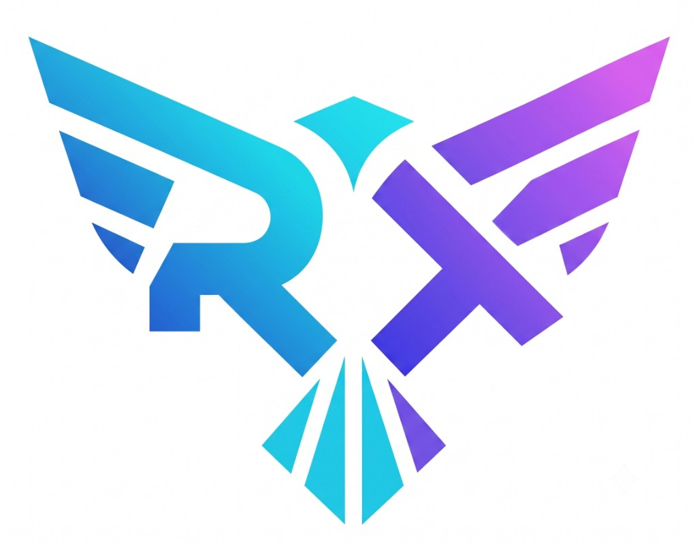
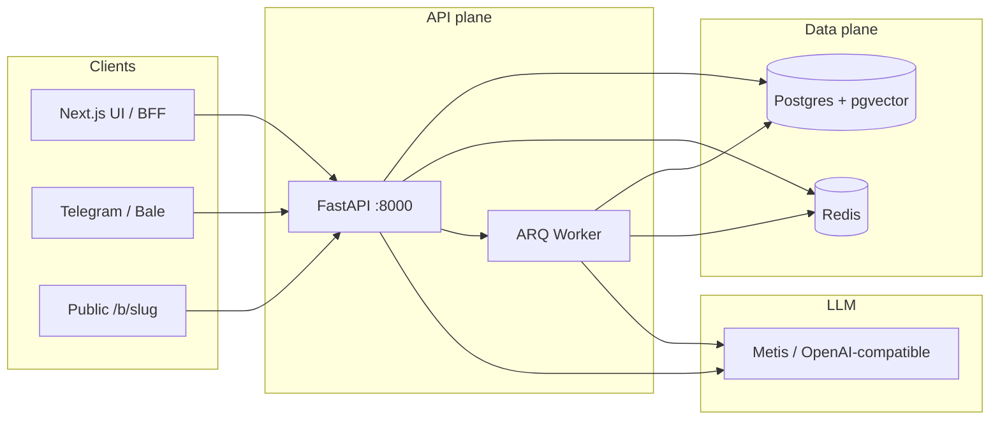
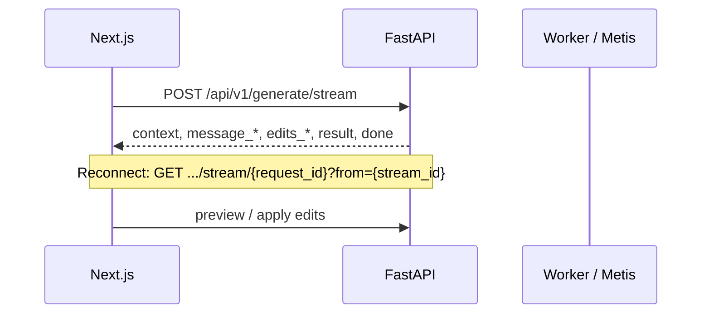

# همیار کد رشید | Rashid Agent

[English](README.md) | **فارسی**

<p align="center">
  
</p>

[](https://github.com/Ali-Rashidi-80/rashid-agent/actions/workflows/ci.yml)
[](https://www.python.org/downloads/)
[](https://nodejs.org/)
[](LICENSE)
[](pyproject.toml)

> **ایجنت کدنویسی محلی + پلتفرم دانش چندمستأجری** — FastAPI، Next.js 15، Postgres (pgvector)، Redis و ARQ — با بات تلگرام/بله، OTP، RAG و میرورهای آمادهٔ ایران.

**پیوندهای سریع:** [شروع سریع](#شروع-سریع) · [معماری](#معماری) · [ویژگی‌ها](#ویژگیها) · [مستندات](docs/README.fa.md) · [English](README.md) · [مشارکت](CONTRIBUTING.fa.md) · [امنیت](SECURITY.fa.md) · [مجوز](#مجوز)

---

## این پروژه چیست؟

**همیار کد رشید (Rashid Agent)** یک مونوریپو برای این کارهاست:

1. **دستیار کدنویسی با هوش مصنوعی** — ویرایش زبان‌طبیعی روی مسیر پروژه، استریم SSE، پیش‌نمایش/اعمال با گیت‌های ایمنی.
2. **پایگاه دانش چندمستأجری** — ingest سند (PDF/DOCX/تصویر + OCR)، chunk، embedding و Ask با RAG، جداسازی با RLS در Postgres.
3. **بات سازمانی و پیام‌رسان** — چت عمومی `/b/[slug]`، OTP پیامکی/ادمین، webhook تلگرام و بله، همگام اختیاری ERP RAG.

برای تیم‌هایی که به استک **خودمیزبان**، **جداسازی tenant** و **قابل استقرار در ایران** نیاز دارند (میرور چابکان برای PyPI، npm، Docker، apt).

ساخته‌شده توسط **علی رشیدی**.

---

## فهرست مطالب

- [چرا رشید؟](#چرا-رشید)
- [ویژگی‌ها](#ویژگیها)
- [معماری](#معماری)
- [ساختار مخزن](#ساختار-مخزن)
- [پشتهٔ فناوری](#پشته-فناوری)
- [پیش‌نیازها](#پیشنیازها)
- [شروع سریع](#شروع-سریع)
- [نحوه استفاده](#نحوه-استفاده)
- [پیکربندی](#پیکربندی)
- [حالت‌های استقرار](#حالتهای-استقرار)
- [سطح API](#سطح-api)
- [تست](#تست)
- [نقشهٔ مستندات](#نقشه-مستندات)
- [سوالات متداول](#سوالات-متداول)
- [عیب‌یابی](#عیبیابی)
- [امنیت](#امنیت)
- [مشارکت](#مشارکت)
- [مجوز](#مجوز)
- [تماس](#تماس)

---

## چرا رشید؟

| درد | پاسخ این مخزن |
|-----|----------------|
| ایجنت فقط ابری | اجرا **محلی** (hybrid) یا Docker/VPS خودتان |
| یک انبار دانش مشترک | **tenant + RLS** روی جداول KB |
| بات‌های وصله‌ای | `org_bot`، OTP، تلگرام/بله درجه‌یک |
| نصب کند در ایران | میرور پیش‌فرض **چابکان** |
| استریم مبهم LLM | پروتکل **SSE** مستند |

---

## ویژگی‌ها

| حوزه | قابلیت‌ها |
|------|-----------|
| **ایجنت کد** | تولید استریم، بسته‌بندی context، پیش‌نمایش ادیت، apply با بکاپ، sandbox مسیر |
| **دانش (RAG)** | آپلود → متن/OCR → chunk → embed → retrieve؛ ARQ برای فایل بزرگ |
| **چندمستأجری** | ادمین tenant، seed (`adl-omid`)، Bearer برای KB/بات/integrations |
| **بات سازمانی** | صفحهٔ slug عمومی، allowlist موبایل + OTP، Ask محدود به یک KB |
| **پیام‌رسان** | webhook تلگرام و بله، توکن رمزشده، long-poll برای توسعه لوکال |
| **پل ERP** | همگام اختیاری از ERP Liquidglass به KB |
| **عملیات** | health، Alembic، CI، پروفایل‌های compose |
| **UX** | UI نکست (`fa`/`en`)، پنل Knowledge و Bots |

---

## معماری

مسیر کلی درخواست (جزئیات: [docs/architecture.fa.md](docs/architecture.fa.md)):

```text
Browser → Next.js BFF (:3000) → FastAPI (:8000) → Postgres (pgvector) + Redis
                                      ↓
                                 ARQ Worker → Metis API
                                      ↓
                    Telegram/Bale webhooks → org_bot → KB RAG (Ask)
```



### مدل داده چندمستأجری

```text
tenant
  ├── tenant_admins
  ├── knowledge_bases
  ├── org_bots
  └── messenger_integrations
```

جداسازی KB با **RLS** و نقش `rashid_app`. جزئیات: [docs/multi-tenant.fa.md](docs/multi-tenant.fa.md).

### جریان SSE ایجنت کد



جدول رویدادها: [docs/agent-protocol.fa.md](docs/agent-protocol.fa.md).

---

## ساختار مخزن

```text
rashid-agent/
├── backend/          # FastAPI، Alembic، worker، تست
├── frontend/         # Next.js 15
├── docs/             # مستندات EN پیش‌فرض + نسخهٔ FA
├── scripts/          # میرور، infra، migrate، stack-up، smoke…
├── docker/ · config/mirrors/
├── docker-compose*.yml
├── legacy/           # منسوخ — برای کار جدید استفاده نکنید
└── pyproject.toml
```

---

## پشتهٔ فناوری

| لایه | انتخاب |
|------|--------|
| API | FastAPI، Pydantic v2، SQLAlchemy async، Alembic |
| UI | Next.js 15، TypeScript، Tailwind |
| داده | PostgreSQL 16 + pgvector، Redis 7 |
| صف | ARQ |
| LLM | Metis سازگار با OpenAI |
| OCR | RapidOCR → Tesseract → Metis vision |
| CI | GitHub Actions |

---

## پیش‌نیازها

- Python **3.11+**
- Node.js **20+** و npm
- Docker Desktop (یا Engine)
- PowerShell در ویندوز برای `scripts/*.ps1`
- کلید `METIS_API_KEY` در `.env`
- برای بیلد ایران: ابتدا `.\scripts\setup-mirrors.ps1` — [docs/mirrors-iran-fa.md](docs/mirrors-iran-fa.md)

---

## شروع سریع

مسیر hybrid (API/UI روی host، DB/Redis در Docker):

```powershell
git clone https://github.com/Ali-Rashidi-80/rashid-agent.git
cd rashid-agent

copy .env.example .env
copy frontend\.env.example frontend\.env.local
# پر کنید: METIS_API_KEY ، SECRETS_ENCRYPTION_KEY ، TENANT_SEED_* ، POSTGRES_PASSWORD

.\scripts\setup-mirrors.ps1
pip install -e ".[dev]"
.\scripts\infra-up.ps1
.\scripts\migrate.ps1
.\scripts\dev.ps1                 # API → http://127.0.0.1:8000
```

ترمینال دوم — UI:

```powershell
cd frontend
npm install
npm run dev                       # UI → http://127.0.0.1:3000
```

Worker اختیاری:

```powershell
.\scripts\smoke-worker.ps1 start
```

**بررسی:** `curl http://127.0.0.1:8000/api/v1/health` · UI: http://127.0.0.1:3000  
پس از login: `/knowledge` و `/bots`.

راهنمای کامل: [docs/quickstart-fa.md](docs/quickstart-fa.md) · [English](docs/quickstart.md)

### یک‌خطی‌ها

| هدف | فرمان |
|-----|--------|
| Infra hybrid | `.\scripts\infra-up.ps1` |
| استک کامل Docker | `.\scripts\stack-up.ps1` |
| چابکان خام | `.\scripts\chabokan-stack-up.ps1` |
| آینه DR | `.\scripts\local-mirror-up.ps1` |
| تست زنده | `python scripts/live_docker_stack_test.py` |

> **توجه:** UI قدیمی (`legacy/main.py`) منسوخ است.

---

## نحوه استفاده

### ایجنت کد (وب)

1. مسیر پروژه را انتخاب کنید.
2. درخواست را به زبان طبیعی بنویسید.
3. تحلیل و ادیت‌های پیشنهادی را ببینید.
4. پیش‌نمایش و اعمال — فقط داخل sandbox مسیر پروژه؛ بکاپ از apply محافظت می‌کند.

**نمونه درخواست:** «تابع مرتب‌سازی اضافه کن» · «کد تکراری را پاکسازی کن» · «لاگ ساخت‌یافته اضافه کن».

### دانش و بات

1. ورود tenant (`POST /api/v1/tenants/login` یا UI).
2. `/knowledge` — ساخت KB و آپلود.
3. `/bots` — `org_bot` + OTP / allowlist.
4. اختیاری: `/b/<slug>`، [تلگرام](docs/telegram.fa.md)، [بله](docs/bale.fa.md)، [ERP](docs/erp-rag-bridge.fa.md).

---

## پیکربندی

| فایل | نقش |
|------|-----|
| `.env.example` → `.env` | ریشه / بکند |
| `frontend/.env.example` → `.env.local` | Next.js |
| `.env.local-mirror.example` | استک آینه |
| `.env.chabokan.split.example` | پنل چابکان جدا |

متغیرهای حیاتی: `METIS_API_KEY`، `SECRETS_ENCRYPTION_KEY`، `POSTGRES_PASSWORD`، `TENANT_SEED_*`، `KB_*`، `SMS_*`. هرگز `.env` واقعی را commit نکنید.

پورت‌های پیش‌فرض: API **8000**، Web **3000**، Postgres **5432**، Redis میزبان **6380**.

---

## حالت‌های استقرار

| حالت | فایل / اسکریپت |
|------|----------------|
| Hybrid | `infra-up` |
| Full local | `stack-up.ps1` |
| Chabokan raw | `chabokan-stack-up.ps1` |
| Local mirror | `local-mirror-up.ps1` |

جزئیات: [docs/deployment.fa.md](docs/deployment.fa.md) · [EN](docs/deployment.md)

---

## سطح API

Health، generate/agent، tenants، knowledge-bases، org-bots، public bots، integrations (+ webhook)، models.  
قرارداد SSE: [docs/agent-protocol.fa.md](docs/agent-protocol.fa.md).

---

## تست

```powershell
$env:PYTHONPATH="backend"
python -m pytest backend/tests -v
python scripts/live_docker_stack_test.py
```

---

## نقشهٔ مستندات

ایندکس: [docs/README.fa.md](docs/README.fa.md) · پیش‌فرض انگلیسی: [docs/README.md](docs/README.md)

همهٔ موضوعات اصلی نسخهٔ `*.md` (انگلیسی) و `*.fa.md` / `*-fa.md` (فارسی) دارند.

همچنین: [CONTRIBUTING.fa.md](CONTRIBUTING.fa.md) · [SECURITY.fa.md](SECURITY.fa.md)

---

## سوالات متداول

**کلید API؟** `METIS_API_KEY` در `.env`.  
**آفلاین کامل؟** زیرساخت محلی است؛ LLM معمولاً به شبکه نیاز دارد.  
**لغو تغییرات؟** از بکاپ apply استفاده کنید.  
**UI قدیمی؟** پشتیبانی نمی‌شود.  
**یک توکن تلگرام برای همه tenant؟** خیر — هر integration جدا و رمزشده است.

---

## عیب‌یابی

| نشانه | بررسی |
|-------|--------|
| health خراب | Docker، `infra-up`، پورت‌ها |
| worker نه | `smoke-worker.ps1 start` |
| آپلود بزرگ | worker + `KB_ARQ_*` |
| webhook تلگرام | HTTPS یا long-poll bridge |
| دانلود کند | `setup-mirrors.ps1` |

---

## امنیت

- commit نکردن secretها
- OTP خارج از کانال عمومی
- `RASHID_TOKEN` جایگزین auth tenant نیست
- چرخش توکن در صورت افشا

---

## مشارکت

[CONTRIBUTING.fa.md](CONTRIBUTING.fa.md) · [English](CONTRIBUTING.md)

---

## مجوز

**MIT** — [LICENSE](LICENSE).

---

## تماس

- **سازنده:** علی رشیدی
- **مخزن:** [github.com/Ali-Rashidi-80/rashid-agent](https://github.com/Ali-Rashidi-80/rashid-agent)
- **باگ/پیشنهاد:** GitHub Issues

*آخرین به‌روزرسانی: ۲۰۲۶-۰۸-۲۶*
