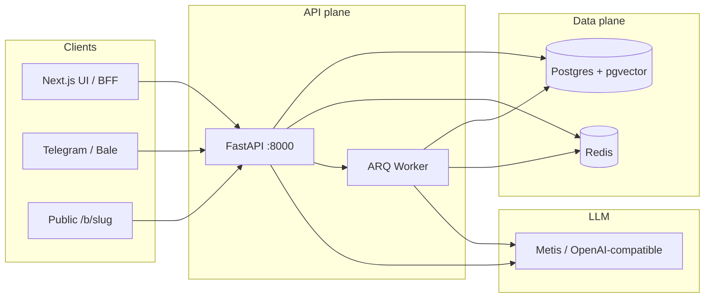
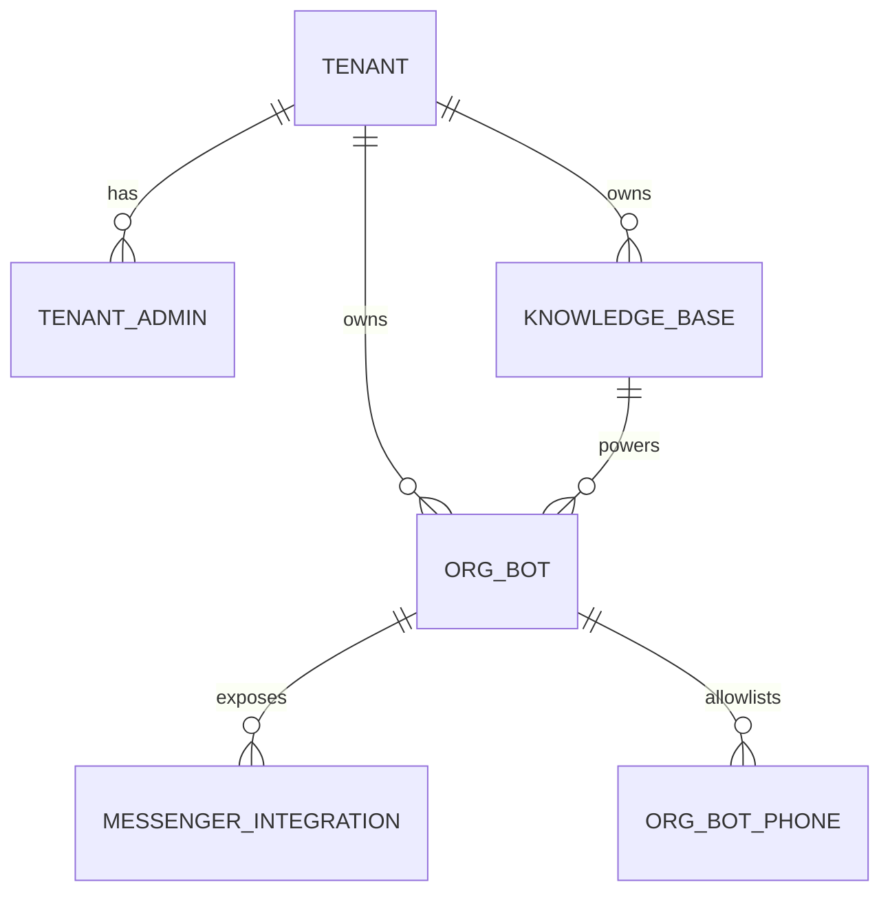
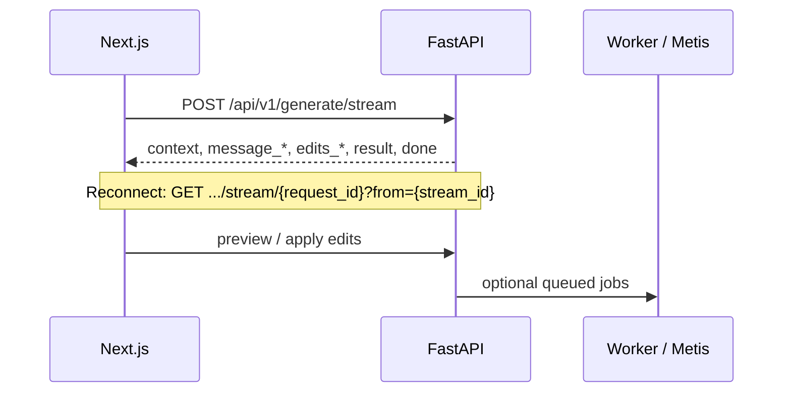
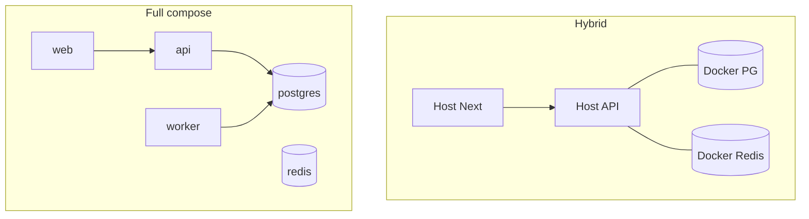

# Rashid Agent

**English** | [فارسی](README.fa.md)

[](https://github.com/Ali-Rashidi-80/rashid-agent/actions/workflows/ci.yml)
[](https://www.python.org/downloads/)
[](https://nodejs.org/)
[](LICENSE)
[](pyproject.toml)

> **Local-first coding agent + multi-tenant knowledge platform** — FastAPI, Next.js 15, Postgres (pgvector), Redis, and ARQ — with Telegram/Bale bots, OTP, RAG, and Iran-ready Docker mirrors.

**Quick links:** [Quick Start](#quick-start) · [Architecture](#architecture) · [Features](#features) · [Docs](docs/README.md) · [فارسی](README.fa.md) · [Contributing](CONTRIBUTING.md) · [Security](SECURITY.md) · [License](#license)

---

## What it is

**Rashid Agent** (همیار کد رشید) is a monorepo for:

1. **AI coding assistance** — natural-language edits against a selected project path, streamed over SSE, with preview/apply and safety gates.
2. **Multi-tenant knowledge bases** — document ingest (PDF/DOCX/images + OCR), chunking, embeddings, and RAG ask flows, isolated with Postgres RLS.
3. **Org bots & messengers** — public `/b/[slug]` chat, SMS/admin OTP, Telegram & Bale webhooks, optional ERP RAG sync.

Built for professional teams that need a **self-hosted**, **tenant-isolated**, and **deployable-in-Iran** stack (Chabokan mirrors for PyPI, npm, Docker, apt).

Created by **Ali Rashidi**.

---

## Table of contents

- [Why Rashid Agent](#why-rashid-agent)
- [Features](#features)
- [Architecture](#architecture)
- [Repository layout](#repository-layout)
- [Tech stack](#tech-stack)
- [Prerequisites](#prerequisites)
- [Quick start](#quick-start)
- [Usage](#usage)
- [Configuration](#configuration)
- [Deploy topologies](#deploy-topologies)
- [API surface](#api-surface)
- [Testing](#testing)
- [Documentation map](#documentation-map)
- [FAQ](#faq)
- [Troubleshooting](#troubleshooting)
- [Security](#security)
- [Contributing](#contributing)
- [License](#license)
- [Contact](#contact)

---

## Why Rashid Agent

| Pain | What this repo does |
|------|---------------------|
| Cloud-only coding agents | Runs **locally** (hybrid) or in **your** Docker/VPS |
| One shared knowledge dump | **Tenants + RLS** on knowledge tables |
| Bots bolted on later | First-class **org_bot**, OTP, Telegram/Bale |
| Slow installs in Iran | Default **Chabokan** mirrors for images & packages |
| Opaque LLM streams | Documented **SSE** agent protocol |

---

## Features

| Area | Capabilities |
|------|----------------|
| **Coding agent** | Streamed generation, context packing, edit preview, apply with backups, path sandboxing |
| **Knowledge (RAG)** | Upload → text/OCR → chunk → embed → retrieve; ARQ for large files; statuses `ready` / `partial` / `failed` |
| **Multi-tenant** | Tenant admins, seed tenant (`adl-omid`), Bearer auth for KB/bots/integrations |
| **Org bots** | Public slug pages, phone allowlist + OTP (SMS or admin), Ask scoped to one KB |
| **Messengers** | Telegram & Bale webhooks, encrypted bot tokens, long-poll bridge for local dev |
| **ERP bridge** | Optional sync from Liquidglass ERP RAG into tenant KB |
| **Ops** | Health checks, Alembic migrations, CI (ruff/black/isort/flake8 + pytest), compose profiles |
| **UX** | Next.js UI (`fa` / `en`), dark-capable shell, Knowledge & Bots panels |

---

## Architecture

High-level request path (also in [docs/architecture.md](docs/architecture.md)):

```text
Browser → Next.js BFF (:3000) → FastAPI (:8000) → Postgres (pgvector) + Redis
                                      ↓
                                 ARQ Worker → Metis API
                                      ↓
                    Telegram/Bale webhooks → org_bot → KB RAG (Ask)
```



### Multi-tenant data model

```text
tenant
  ├── tenant_admins          # dashboard login → /knowledge, /bots
  ├── knowledge_bases        # docs + chunks + embeddings
  ├── org_bots               # public /b/[slug] + OTP
  └── messenger_integrations # Telegram/Bale → org_bot → KB
```



KB isolation uses **Postgres RLS** with application role `rashid_app` (no `BYPASSRLS`). Details: [docs/multi-tenant.md](docs/multi-tenant.md).

### Coding agent SSE flow



Event table: [docs/agent-protocol.md](docs/agent-protocol.md).

---

## Repository layout

```text
rashid-agent/
├── backend/                 # FastAPI app, Alembic, ARQ worker, tests
│   ├── app/                 # routers, services, domain, db, auth
│   ├── worker/              # ARQ settings & tasks
│   └── alembic/             # migrations (tenants, KB, messenger, …)
├── frontend/                # Next.js 15 (App Router, BFF proxy, i18n)
├── docs/                    # English-default docs + Persian siblings
├── scripts/                 # setup-mirrors, infra, migrate, stack-up, smoke…
├── docker/                  # apt/pip helpers for Chabokan builds
├── config/mirrors/          # mirror templates (pip, npm, daemon.json)
├── docker-compose.yml       # hybrid infra + profile `full`
├── docker-compose.chabokan.yml
├── docker-compose.local-mirror.yml
├── legacy/                  # deprecated UI — do not use for new work
└── pyproject.toml           # Python package `rashid-agent` 0.1.0
```

---

## Tech stack

| Layer | Choice |
|-------|--------|
| API | FastAPI, Pydantic v2, SQLAlchemy async, Alembic |
| UI | Next.js 15, TypeScript, Tailwind |
| Data | PostgreSQL 16 + **pgvector**, Redis 7 |
| Jobs | ARQ (KB ingest, messenger updates) |
| LLM | Metis OpenAI-compatible (`METIS_*`) |
| OCR | RapidOCR → Tesseract → Metis vision (fallback chain) |
| Auth | Tenant admin JWT/Bearer; optional global `RASHID_TOKEN` |
| CI | GitHub Actions — lint + migrate + pytest |

---

## Prerequisites

- **Python 3.11+**
- **Node.js 20+** and npm
- **Docker Desktop** (or Engine) for Postgres/Redis (and full stacks)
- **PowerShell** on Windows for `scripts/*.ps1`
- **Metis/OpenAI-compatible API key** in `.env` (`METIS_API_KEY`)
- For Iran/offline-ish builds: run `.\scripts\setup-mirrors.ps1` first — see [docs/mirrors-iran.md](docs/mirrors-iran.md)

---

## Quick start

Canonical hybrid path (API/UI on host, DB/Redis in Docker):

```powershell
git clone https://github.com/Ali-Rashidi-80/rashid-agent.git
cd rashid-agent

copy .env.example .env
copy frontend\.env.example frontend\.env.local
# Fill: METIS_API_KEY, SECRETS_ENCRYPTION_KEY, TENANT_SEED_*, POSTGRES_PASSWORD

.\scripts\setup-mirrors.ps1
pip install -e ".[dev]"
.\scripts\infra-up.ps1
.\scripts\migrate.ps1
.\scripts\dev.ps1                 # API → http://127.0.0.1:8000
```

Second terminal — UI:

```powershell
cd frontend
npm install
npm run dev                       # UI → http://127.0.0.1:3000
```

Optional worker (large KB ingest / queued Telegram):

```powershell
.\scripts\smoke-worker.ps1 start
```

**Verify**

```bash
curl http://127.0.0.1:8000/api/v1/health
```

Open http://127.0.0.1:3000 — after tenant login: `/knowledge`, `/bots`.

Full walkthrough: [docs/quickstart.md](docs/quickstart.md) · [فارسی](docs/quickstart-fa.md)

### One-liners

| Goal | Command |
|------|---------|
| Hybrid infra | `.\scripts\infra-up.ps1` |
| Full local Docker | `.\scripts\stack-up.ps1` |
| Chabokan raw stack | `.\scripts\chabokan-stack-up.ps1` |
| Local DR mirror | `.\scripts\local-mirror-up.ps1` |
| Live stack test | `python scripts/live_docker_stack_test.py` |

> **Note:** The legacy UI (`legacy/main.py`) is deprecated. Use the stack above.

---

## Usage

### Coding agent (web)

1. Open the UI and set the **project path** (tenant seed may preconfigure `TENANT_SEED_CODE_PROJECT_PATH`).
2. Describe the change in natural language (EN or FA).
3. Review streamed analysis and proposed edits.
4. Preview, then apply — changes stay inside the project sandbox; backups protect apply.

**Example prompts**

- “Add a list-sorting helper and unit tests.”
- “Find duplicated logic and consolidate it.”
- “Rename unclear variables to conventional names.”
- “Optimize hot loops and add structured logging.”

### Knowledge & bots

1. `POST /api/v1/tenants/login` (or UI login) with seed admin credentials.
2. `/knowledge` — create a KB, upload documents (OCR/ARQ as needed).
3. `/bots` — create an `org_bot` on that KB; issue OTP / allowlist phones.
4. Optional public chat: `/b/<slug>`.
5. Optional messengers: [Telegram](docs/telegram.md) · [Bale](docs/bale.md).
6. Optional ERP sync: [ERP RAG bridge](docs/erp-rag-bridge.md).

---

## Configuration

Copy templates (secrets stay **empty** in examples — never commit real `.env`):

| File | Role |
|------|------|
| `.env.example` → `.env` | Root / backend |
| `frontend/.env.example` → `.env.local` | Next.js BFF (`BACKEND_URL`) |
| `.env.local-mirror.example` | DR mirror stack |
| `.env.chabokan.split.example` | Split web/API on Chabokan panel |

<details>
<summary><strong>Critical environment variables</strong></summary>

| Variable | Purpose |
|----------|---------|
| `METIS_API_KEY` | LLM + embeddings |
| `SECRETS_ENCRYPTION_KEY` | Encrypt messenger bot tokens at rest |
| `POSTGRES_PASSWORD` / `DATABASE_URL` | Database |
| `REDIS_URL` / `ARQ_REDIS_URL` | Cache / jobs |
| `TENANT_SEED_ADMIN_USER` / `PASSWORD` | First tenant admin |
| `TENANT_SEED_CODE_PROJECT_PATH` | Default code project for agent |
| `RASHID_TOKEN` | Optional global API lock (not a tenant substitute) |
| `KB_*` | Chunk size, top-k, upload limits, OCR vision model |
| `SMS_*` / `MELIPAYAMAK_*` | OTP SMS (`stub` locally, `real` in prod) |
| `TELEGRAM_*` / `BALE_*` | Dev seed only — prefer Integrations API |
| `*_IMAGE` | Override Docker images if mirror tags are missing |

</details>

Default ports: API **8000**, Web **3000**, Postgres **5432**, Redis host publish **6380**. Mirror stack uses **8001** / **3001** / **5433** / **6381**.

---

## Deploy topologies

| Mode | Compose / script | Use when |
|------|------------------|----------|
| Hybrid dev | `docker-compose.yml` + `infra-up` | Daily development |
| Full local | `--profile full` / `stack-up.ps1` | All-in-Docker locally |
| Chabokan raw | `docker-compose.chabokan.yml` | Remote VPS / raw containers (`rashid-chabokan-*`) |
| Local mirror | `docker-compose.local-mirror.yml` | DR clone (`rashid-mirror-*`) |
| Backend split | `backend/docker-compose.yml` | Managed DB/Redis + separate web |

Full guide: [docs/deployment.md](docs/deployment.md) · [فارسی](docs/deployment.fa.md)



---

## API surface

| Area | Prefix / notes |
|------|----------------|
| Health | `GET /health`, `GET /api/v1/health` |
| Generate / agent | `/api/v1/generate/*`, `/api/v1/agent/*` |
| Tenants | `/api/v1/tenants/login`, … |
| Knowledge | `/api/v1/knowledge-bases/*` |
| Org bots | `/api/v1/org-bots/*` |
| Public bots | `/api/v1/public/bots/{slug}/*` |
| Integrations | `/api/v1/integrations` + Telegram/Bale webhooks |
| Models | `/api/v1/models` |

SSE contract: [docs/agent-protocol.md](docs/agent-protocol.md). Frontend BFF proxies `/api/v1/*` to `BACKEND_URL`.

---

## Testing

```powershell
$env:PYTHONPATH="backend"
python -m pytest backend/tests -v
```

CI also runs `ruff`, `black --check`, `isort --check-only`, `flake8`, Alembic upgrade, and worker-aware tests. See [.github/workflows/ci.yml](.github/workflows/ci.yml).

Live Docker verification:

```powershell
python scripts/live_docker_stack_test.py
```

---

## Documentation map

| Doc | Topic |
|-----|--------|
| [docs/README.md](docs/README.md) | Docs index (EN) · [FA](docs/README.fa.md) |
| [docs/quickstart.md](docs/quickstart.md) | Hybrid quickstart · [FA](docs/quickstart-fa.md) |
| [docs/architecture.md](docs/architecture.md) | Layers & topologies · [FA](docs/architecture.fa.md) |
| [docs/deployment.md](docs/deployment.md) | Docker / Chabokan / mirror · [FA](docs/deployment.fa.md) |
| [docs/infrastructure.md](docs/infrastructure.md) | Ports, health, volumes · [FA](docs/infrastructure.fa.md) |
| [docs/multi-tenant.md](docs/multi-tenant.md) | Tenants, RLS, seed · [FA](docs/multi-tenant.fa.md) |
| [docs/knowledge-ingest.md](docs/knowledge-ingest.md) | Upload, OCR, ARQ · [FA](docs/knowledge-ingest.fa.md) |
| [docs/telegram.md](docs/telegram.md) | Webhook, OTP, bridge · [FA](docs/telegram.fa.md) |
| [docs/bale.md](docs/bale.md) | Bale integration · [FA](docs/bale.fa.md) |
| [docs/erp-rag-bridge.md](docs/erp-rag-bridge.md) | ERP → KB sync · [FA](docs/erp-rag-bridge.fa.md) |
| [docs/agent-protocol.md](docs/agent-protocol.md) | SSE events · [FA](docs/agent-protocol.fa.md) |
| [docs/mirrors-iran.md](docs/mirrors-iran.md) | Iran mirrors · [FA](docs/mirrors-iran-fa.md) |
| [CONTRIBUTING.md](CONTRIBUTING.md) | Contribution guide · [FA](CONTRIBUTING.fa.md) |
| [SECURITY.md](SECURITY.md) | Vulnerability reporting · [FA](SECURITY.fa.md) |

---

## FAQ

**How do I get an API key?**  
Use a Metis (or compatible) key and set `METIS_API_KEY` in `.env`. `OPENAI_API_KEY` may be used depending on provider routing.

**Does it work fully offline?**  
Infrastructure can run locally, but LLM/embedding calls need network access to your Metis/OpenAI-compatible endpoint (unless you point to a local gateway).

**How do I undo applied edits?**  
Use the backup mechanism around apply; restore prior file versions from the backup location configured by the agent/apply path.

**Is the old desktop/legacy UI supported?**  
No — use Next.js + FastAPI. `legacy/` remains for reference only.

**Can one Telegram token serve all tenants?**  
No. Each integration is tenant/org_bot scoped; tokens are encrypted with `SECRETS_ENCRYPTION_KEY`.

---

## Troubleshooting

| Symptom | What to check |
|---------|----------------|
| Health shows redis/postgres not ok | `.\scripts\infra-up.ps1`, ports in `.env`, Docker running |
| Worker not ok | `.\scripts\smoke-worker.ps1 start` or compose `worker` |
| Large upload stuck / never ready | ARQ worker + `KB_ARQ_INGEST_MIN_BYTES` |
| Telegram webhook timeouts | HTTPS public URL, or `python scripts/telegram_longpoll_bridge.py` |
| Slow pip/npm/docker pulls in Iran | `.\scripts\setup-mirrors.ps1` + [mirrors guide](docs/mirrors-iran.md) |
| Project path errors | Ensure path exists and stays inside allowed roots |
| Migration failures | `.\scripts\migrate.ps1`; see Alembic under `backend/alembic/` |

---

## Security

- Never commit `.env`, bot tokens, or OTP secrets.
- Prefer Integrations API over baking `TELEGRAM_BOT_TOKEN` into env for production.
- Deliver OTP out-of-band; keep phone allowlists tight.
- `RASHID_TOKEN` is a coarse gate — it does **not** replace tenant auth.
- Path sandboxing restricts coding-agent writes to the selected project tree.
- Rotate leaked messenger tokens via BotFather/Bale and recreate the integration.

---

## Contributing

Contributions are welcome. See [CONTRIBUTING.md](CONTRIBUTING.md) · [فارسی](CONTRIBUTING.fa.md).

Short path:

1. Fork and branch from the active development branch.
2. Keep changes focused; match existing style (ruff/black/isort).
3. Add/adjust tests under `backend/tests/`.
4. Open a PR with a clear “why”.

```powershell
python -m ruff check backend
python -m black backend
python -m isort backend
$env:PYTHONPATH="backend"; python -m pytest backend/tests -q
```

---

## License

Released under the **MIT License** — see [LICENSE](LICENSE).

---

## Contact

- **Author:** Ali Rashidi
- **Repository:** [github.com/Ali-Rashidi-80/rashid-agent](https://github.com/Ali-Rashidi-80/rashid-agent)
- **Issues:** use GitHub Issues for bugs and feature requests

🇮🇷 Persian docs available via [README.fa.md](README.fa.md) and `docs/*.fa.md` · 🇺🇸 English is the default.

*Last updated: 2026-08-26*
