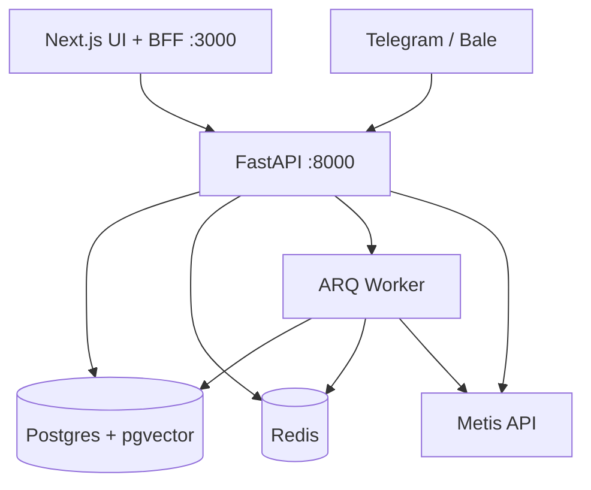

# معماری — همیار کد رشید

[English](architecture.md) | **فارسی**

## لایه‌ها

```text
Browser → Next.js BFF (:3000) → FastAPI (:8000) → Postgres (pgvector) + Redis
                                      ↓
                                 ARQ Worker → Metis API
                                      ↓
                    Telegram/Bale webhooks → org_bot → KB RAG (Ask)
```



## بکند (`backend/app/`)

| بخش | نقش |
|-----|-----|
| `routers/` | لایه نازک HTTP |
| `services/` | Metis، استریم، KB، webhook، ERP |
| `domain/` | منطق خالص (patch، SSE) |
| `db/` | مدل، ریپازیتوری، RLS، Alembic |
| `auth/` | احراز ادمین tenant |
| `prompts/` | رجیستری پرامپت |

## فرانت (`frontend/src/`)

| بخش | نقش |
|-----|-----|
| `features/chat` | Composer، SSE، خروجی |
| `features/knowledge` | UI پایگاه دانش |
| `features/bots` | org_bot + OTP |
| `app/api/v1` | پروکسی BFF → `BACKEND_URL` |
| `app/b/[slug]` | چت عمومی بات |

## صفحهٔ داده چندمستأجری

[multi-tenant.fa.md](./multi-tenant.fa.md) — جداسازی با tenant id و RLS.

## توپولوژی استقرار

[deployment.fa.md](./deployment.fa.md): hybrid، compose `full`، چابکان خام، آینهٔ لوکال.
