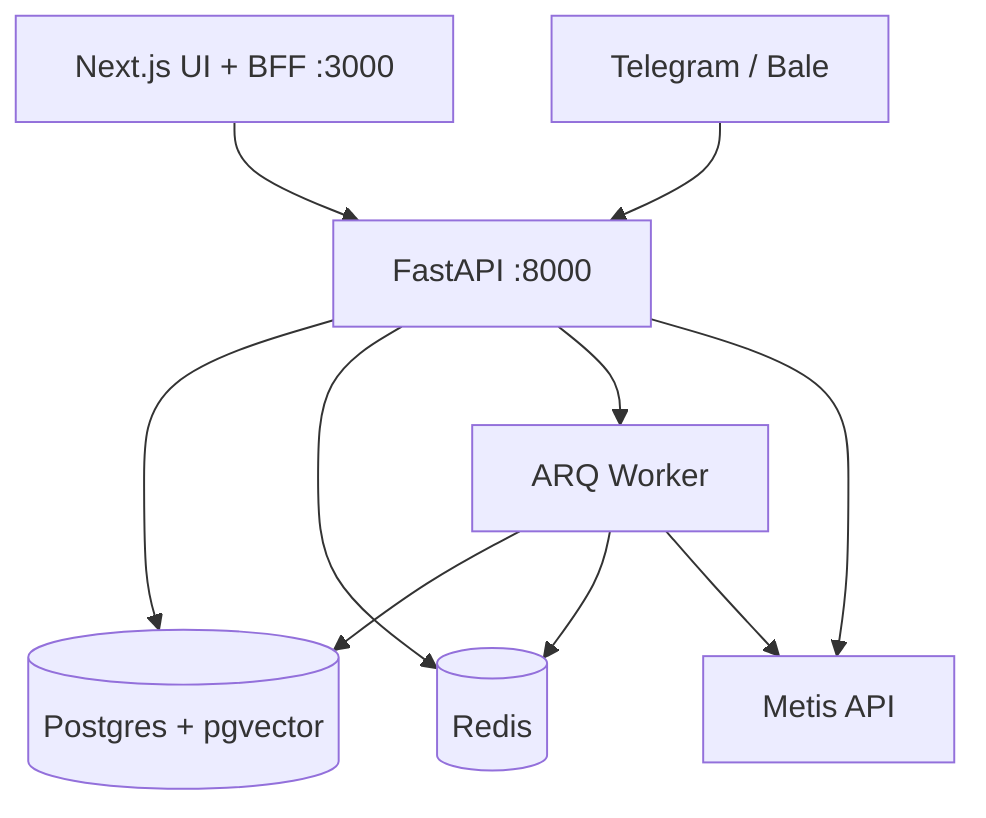

# Architecture — Rashid Agent

**English** | [فارسی](architecture.fa.md)

## Layers

```text
Browser → Next.js BFF (:3000) → FastAPI (:8000) → Postgres (pgvector) + Redis
                                      ↓
                                 ARQ Worker → Metis API
                                      ↓
                    Telegram/Bale webhooks → org_bot → KB RAG (Ask)
```



## Backend (`backend/app/`)

| Area | Role |
|------|------|
| `routers/` | HTTP thin layer (agent, generate, knowledge, tenants, org_bots, integrations) |
| `services/` | Metis, generate_stream, KB ingest/retrieve, telegram webhook, ERP sync |
| `domain/` | Pure logic (patch engine, SSE parse) |
| `db/` | Models, repositories, RLS tenant context, Alembic |
| `auth/` | Tenant admin auth |
| `prompts/` | Prompt registry |

## Frontend (`frontend/src/`)

| Area | Role |
|------|------|
| `features/chat` | Composer, SSE, output |
| `features/knowledge` | KB admin UI |
| `features/bots` | org_bot + OTP UI |
| `app/api/v1` | BFF proxy → `BACKEND_URL` |
| `app/b/[slug]` | Public bot chat |

## Multi-tenant data plane

See [multi-tenant.md](./multi-tenant.md). Isolation: tenant id on rows + Postgres RLS for KB; messenger links scoped to integration/tenant.

## Deploy topologies

See [deployment.md](./deployment.md): hybrid, compose `full`, Chabokan raw (`rashid-chabokan-*`), local mirror (`rashid-mirror-*`).
